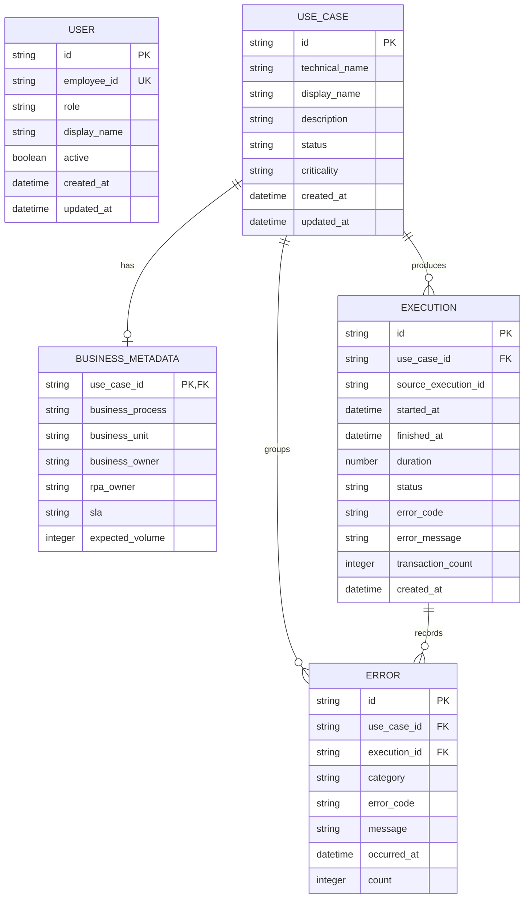

# RPA Performance & Monitoring Platform - Product Requirements Document

## Document information

| Field | Value |
| --- | --- |
| **Title** | RPA Performance & Monitoring Platform (RPMP) - Product Requirements Document |
| **Version** | 1.1 |
| **Date** | 2026-09-06 |
| **Status** | Draft |
| **Purpose** | Define stable product, persona, functional, non-functional, data, and technical requirements for the RPMP MVP |

### Agent usage

- Always-on context is `AGENTS.md`, not this whole PRD.
- Orchestrate Phase 1 reads only the FR, persona, and NFR IDs in scope.
- For MEDIUM work, run `grill-me` when an in-scope FR is TBD.
- Do not invent Orchestrator vendor fields in the UI contract.
- The original 44-section draft is preserved at `docs/PRD.draft-v1.md`.

---

## 1. Executive summary

### Product vision

> Turn raw RPA operational data into actionable performance and monitoring insights.

RPMP is an internal, human-readable source of truth for RPA performance, health, and operational monitoring. It transforms data from Orchestrator and related approved sources into consistent information for routine monitoring and later KRI reporting.

RPMP is an information layer. It is not a replacement for Orchestrator, a robot development tool, or a robot control plane.

### Target users

- **RPA Developer**: performance and error diagnostics.
- **RPA Operator / Support**: routine monitoring and incident detection.
- **Business User**: simple health and performance information without vendor terminology.
- **RPA Manager**: portfolio, trend, and operational risk overview.
- **Management**: executive visibility into the RPA portfolio.

### Key value propositions

1. Replace repeated manual queries, spreadsheet cleanup, formulas, and templates for routine monitoring.
2. Present technical RPA operations in business-readable terms.
3. Highlight use cases that need attention.
4. Keep metric definitions consistent across users and periods.
5. Establish the data foundation for later KRI automation, alerts, and business-impact analysis.

### Business impact

- Reduce manual reporting effort by at least 70%.
- Reduce routine dependence on spreadsheet transformation.
- Let users identify a problematic use case in under one minute.
- Improve portfolio visibility and consistency of operational reporting.
- Reduce the need for business users to open Orchestrator for routine monitoring.

---

## 2. Product overview

### Background

Execution and transaction data already exist in Orchestrator and related databases, but they are not ready for business monitoring or recurring reports. Today, teams may run manual queries, clean data, build spreadsheet formulas, and copy results into KRI templates each period.

Business users also face a technical Orchestrator interface designed for operations and development rather than portfolio-level interpretation.

### Problem statement

1. **Manual reporting**: repeated extraction and spreadsheet work consumes time, risks human error, and lets metric logic drift between users.
2. **Technical monitoring**: users must interpret vendor-specific fields to answer basic questions about health, success rate, failures, SLA, and trends.
3. **Data without insight**: operational data exists, but a normalized, business-readable information layer does not.

### Solution overview

```text
Orchestrator / approved RPA source
  → Source adapter / data collector
  → Raw model
  → Normalized RPMP model
  → Business metrics
  → Versioned backend API
  → Dashboard and Use Cases
```

The MVP has two main menus:

- **Dashboard**: portfolio-level KPI, trend, error, status, and attention views.
- **Use Cases**: searchable and filterable automation list with a performance detail page.

### Platform

- Web only.
- Internal users only for MVP.
- Internal authentication first, designed for later SSO.
- Read-only monitoring for routine use. No robot start, stop, scheduling, deployment, or transaction editing.
- Not multi-tenant in MVP.

---

## 3. User personas and use cases

### Persona P-1: RPA Developer

**Profile**: Technical team member who builds or maintains automations.

**Goals**:

- Understand performance and failure patterns.
- Identify common errors and recent failed executions.
- Compare volume, duration, and success rate over time.

**Pain points**:

- Raw errors are granular and inconsistent.
- Troubleshooting begins with manual queries or technical Orchestrator navigation.
- Historical comparison is slow.

**Primary workflows**:

1. Open Use Cases and search for an automation.
2. Review summary, performance trend, error categories, and recent activity.
3. Use RPMP for initial triage, then open technical systems if deeper debugging is needed.

**Success criteria**:

- Finds the relevant use case and common error in under one minute.
- Can reconcile RPMP counts with the source.

### Persona P-2: RPA Operator / Support

**Profile**: Operational team member responsible for daily RPA monitoring.

**Goals**:

- Detect unhealthy automations early.
- Prioritize follow-up.
- Check freshness and current portfolio status.

**Pain points**:

- Must scan several technical views.
- Attention thresholds and reporting logic are not consistently applied.

**Primary workflows**:

1. Log in and open Dashboard.
2. Review Attention Required and Top Errors.
3. Open a use case, inspect recent activity, and decide whether to escalate.

**Success criteria**:

- Identifies problematic use cases in under one minute.
- Uses RPMP for routine monitoring instead of a spreadsheet.

### Persona P-3: Business User

**Profile**: Process owner or operational business user with low to medium technical knowledge.

**Goals**:

- Understand whether an automation is active and healthy.
- See execution volume and success rate in familiar terms.
- Avoid technical Orchestrator terminology.

**Pain points**:

- Vendor statuses and raw errors are difficult to interpret.
- Access to technical tools may be limited.

**Primary workflows**:

1. View assigned or relevant use cases.
2. Read health, success rate, volume, and last-run information.
3. Open details when a use case needs attention.

**Success criteria**:

- Understands status without learning vendor fields.
- Sees only authorized information.

### Persona P-4: RPA Manager

**Profile**: Manager responsible for the RPA portfolio and operational performance.

**Goals**:

- See portfolio size, active use cases, success rate, failures, and trend.
- Identify operational risk and SLA issues.
- Compare periods.

**Pain points**:

- Portfolio reporting is assembled manually.
- Different reports may use different formulas.

**Primary workflows**:

1. Review dashboard KPIs and trends.
2. Filter use cases by business unit, status, or health.
3. Follow up on critical automations.

**Success criteria**:

- Uses one consistent view for portfolio monitoring.
- Can trace each metric to its source period and freshness timestamp.

### Persona P-5: Management (indirect/summary user)

**Profile**: Senior stakeholder who consumes summary information and future KRI reports.

**Goals**:

- Understand high-level portfolio health and operational risk.
- Track whether monitoring and reporting effort is reduced.

**Pain points**:

- Current reports arrive through manual spreadsheets.
- Technical detail obscures the business signal.

**Primary workflows**:

1. Review summary KPIs and health.
2. Consume future scheduled KRI or management reports.

**Success criteria**:

- Receives concise, accurate, current information.

### Indirect system actor: Orchestrator

Orchestrator remains a source system, not a user of RPMP. RPMP reads through an official API, an approved read-only database/read replica, or another supported export. Direct production database access requires formal approval. RPMP does not send robot-control commands in MVP.

---

## 4. Functional requirements

### FR-1: Authentication and role-based access control

#### FR-1.1: Internal login

**Description**: RPMP shall require authentication for every product screen and protected API.

**Requirements**:

- Initial credentials are Personal Number / Employee ID and password.
- **TBD**: Internal identity store and session mechanism (opaque session or JWT).
- Passwords shall never be stored in plaintext.
- Browser credentials shall use secure, httpOnly cookies.
- Authentication shall allow later replacement with enterprise SSO.
- Login and logout shall be audited.

**User roles**: P-1 through P-5, Admin.

**Business rules**:

- Unauthenticated requests to protected APIs return a standard authentication error.
- No service account, Orchestrator credential, or refresh token is exposed to frontend JavaScript.

**User flow**:

1. User opens RPMP.
2. System requests Employee ID and password, or a future SSO redirect.
3. Backend authenticates and establishes a session.
4. User lands on Dashboard.

**Acceptance criteria**:

- [ ] Unauthenticated users cannot access Dashboard, Use Cases, details, or protected APIs.
- [ ] Valid credentials create a session and open Dashboard.
- [ ] Invalid credentials return a safe, human-readable error.
- [ ] Passwords are securely hashed and transport uses HTTPS.
- [ ] Logout ends the active session.

#### FR-1.2: Viewer and Admin RBAC

**Description**: RPMP shall enforce Viewer and Admin permissions in both API and UI.

**Requirements**:

- Viewer: view Dashboard, Use Cases, and Use Case Detail.
- Admin: all Viewer access plus configuration and business metadata management.
- **TBD**: Whether user/role management is in MVP or handled outside RPMP.
- Future roles may include Super Admin, RPA Admin, RPA Developer, RPA Operator, Business User, and Management.
- Future authorization may restrict users by business unit.

**User roles**: Viewer, Admin.

**Business rules**:

- Hiding a UI control is not authorization; the API verifies the role.
- Administrative actions are audited.

**User flow**:

1. Authenticated user opens a route or calls an API.
2. Backend resolves role and permission.
3. System returns the resource or a forbidden response.

**Acceptance criteria**:

- [ ] Viewer can access all read-only MVP screens.
- [ ] Viewer cannot call Admin configuration APIs.
- [ ] Admin can access enabled configuration functions.
- [ ] UI and API permissions agree.

### FR-2: Dashboard

#### FR-2.1: Dashboard header

**Description**: Dashboard shall show context for the displayed data.

**Requirements**:

- Product name and Dashboard title.
- Human-readable subtitle.
- Last-updated timestamp.
- Selected period.
- Optional refresh action.

**User roles**: Viewer, Admin.

**Business rules**:

- Timestamp represents the newest successful data refresh, not browser render time.
- Period applies consistently to all period-based widgets unless labeled otherwise.

**User flow**: Login → Dashboard → review freshness and period → optionally refresh or change period.

**Acceptance criteria**:

- [ ] Header shows product, page title, freshness, and period.
- [ ] Stale or failed refresh state is visible.

#### FR-2.2: KPI cards

**Description**: Dashboard shall summarize the RPA portfolio.

**Requirements**:

- Total Use Cases.
- Active Use Cases.
- Execution Volume for the selected period.
- Success Rate.
- Failed Executions.
- Optional if data is available: Average Execution Duration and SLA Achievement.
- Health Score is future (FR-5.2), not an MVP KPI requirement.

**User roles**: Viewer, Admin.

**Business rules**:

- `Success Rate = Successful Executions / Total Executions × 100%`.
- Total Use Cases is the count of registered use cases.
- Active Use Cases is the count currently marked Active.
- Execution Volume is total execution/transaction count in the period.
- Failed Executions includes executions normalized as failure/exception.
- Zero executions must not divide by zero. Display `N/A` or the agreed zero-state (**TBD**).

**User flow**: Open Dashboard → select period → compare KPI cards.

**Acceptance criteria**:

- [ ] All five minimum KPIs render from the same selected period where applicable.
- [ ] Success Rate follows the defined formula.
- [ ] Empty periods do not show misleading percentages.

#### FR-2.3: Execution trend

**Description**: Dashboard shall show execution volume over time.

**Requirements**:

- Daily aggregation for MVP.
- Series: Total, Successful, Failed.
- Make spikes, drops, and direction visible.
- **Assumption**: Last 30 Days is the default period until user research confirms it.

**User roles**: Viewer, Admin.

**Business rules**:

- Daily buckets use one agreed business timezone (**TBD**).
- Totals reconcile with KPI cards for the same period.

**User flow**: Open Dashboard → select period → inspect daily trend → open a use case if available from context.

**Acceptance criteria**:

- [ ] Daily total, success, and failure series are visible.
- [ ] Labels and tooltip values are human-readable.
- [ ] Trend totals reconcile with summary totals.

#### FR-2.4: Success and failure distribution

**Description**: Dashboard shall show successful versus failed executions.

**Requirements**:

- Success percentage and count.
- Failure count and percentage.
- Accessible text values; chart alone is insufficient.

**User roles**: Viewer, Admin.

**Business rules**:

- Uses the same normalized statuses and period as FR-2.2.

**User flow**: Open Dashboard → read distribution → compare with trend.

**Acceptance criteria**:

- [ ] Counts and percentages are shown.
- [ ] Values match KPI cards.
- [ ] Information is understandable without color.

#### FR-2.5: Use case status overview

**Description**: Dashboard shall summarize use cases by operational status.

**Requirements**:

- Minimum statuses: Active, Inactive, Error, Maintenance.
- Backend maps source-specific states to RPMP statuses.

**User roles**: Viewer, Admin.

**Business rules**:

- Vendor states are not sent as the UI contract.
- Every registered use case has one current RPMP status or an explicit Unknown status (**TBD**).

**User flow**: Open Dashboard → review status distribution → open filtered Use Cases list.

**Acceptance criteria**:

- [ ] Minimum statuses are represented.
- [ ] Mapping is centralized in the data layer.
- [ ] UI shows RPMP terms only.

#### FR-2.6: Top errors

**Description**: Dashboard shall show the most frequent normalized error categories.

**Requirements**:

- Error category/name, count or percentage.
- Raw granular messages may be grouped, for example SAP timeout variants → `SAP Timeout`.
- **TBD**: Top-N size.

**User roles**: Viewer, Admin.

**Business rules**:

- Normalization runs in the backend data layer.
- Sensitive raw messages are not exposed by default.

**User flow**: Open Dashboard → inspect Top Errors → select an error or use case if drill-down is available.

**Acceptance criteria**:

- [ ] Errors are ranked for the selected period.
- [ ] Category totals are traceable to source records.
- [ ] Raw vendor strings do not become UI labels by accident.

#### FR-2.7: Attention required

**Description**: Dashboard shall identify use cases that need operational follow-up.

**Requirements**:

- Show use case, health level, and reason (for example success-rate drop or duration increase).
- MVP may use rule-based logic.
- Link to Use Case Detail.

**User roles**: Viewer, Admin.

**Business rules**:

- MVP starting thresholds: Critical `< 90%`; Attention `>= 90% and < 97%`; Healthy `>= 97%`.
- Thresholds require validation against operational baseline.
- Configurable thresholds are future unless FR-6 administration is included.

**User flow**: Open Dashboard → select attention item → review detail → decide follow-up.

**Acceptance criteria**:

- [ ] Each item states what needs attention.
- [ ] Health matches FR-5.1.
- [ ] User can reach the related detail page.

### FR-3: Use case list

#### FR-3.1: Search, filters, and columns

**Description**: RPMP shall provide a searchable, filterable list of registered automation use cases.

**Requirements**:

- Search by human-readable name and, for authorized technical users, technical name.
- Filters: Business Unit / Department, Status, Health, Date / Period.
- Minimum columns: Use Case, Business Unit, Status, Execution, Success Rate, Last Run, Health.
- Selecting a row opens FR-4.
- **TBD**: pagination size and sort defaults.

**User roles**: Viewer, Admin.

**Business rules**:

- `Use case` means a business automation, not a software test case.
- Search and filters may combine.
- Period-dependent columns use the selected period.
- Future business-unit authorization may limit visible rows.

**User flow**:

1. Open Use Cases.
2. Search and/or filter.
3. Review columns.
4. Select a use case.

**Acceptance criteria**:

- [ ] User can search use cases.
- [ ] User can filter by business unit, status, health, and period.
- [ ] Minimum columns render and are sortable where useful (**TBD**).
- [ ] Empty and no-result states explain how to recover.

### FR-4: Use case detail

#### FR-4.1: Summary

**Description**: Detail shall identify the selected use case and summarize current performance.

**Requirements**:

- Display Name, Business Process/Unit, Status, and Health.
- Total, successful, and failed executions.
- Success Rate, Average Duration, Last Execution.
- SLA Achievement if source and SLA data exist.
- Back link to Use Cases.

**User roles**: Viewer, Admin.

**Business rules**:

- Health Score number is future; MVP uses FR-5.1 levels.
- Metrics use one visible period.

**User flow**: Use Cases → select row → review summary.

**Acceptance criteria**:

- [ ] Identity, status, health, and minimum metrics are visible.
- [ ] Period and freshness are visible or inherited clearly.
- [ ] User can return to the filtered list.

#### FR-4.2: Performance trend

**Description**: Detail shall show performance over time for one use case.

**Requirements**:

- Success-rate trend.
- Execution and failure volume.
- Average duration.
- Period choices: Today, Last 7 Days, Last 30 Days.
- Custom period is future/optional.

**User roles**: Viewer, Admin.

**Business rules**:

- All series apply to the selected use case and period.
- Timezone is the same as FR-2.3.

**User flow**: Open detail → choose period → compare trend.

**Acceptance criteria**:

- [ ] Minimum trend measures render.
- [ ] Period changes update all detail metrics consistently.

#### FR-4.3: Error analysis

**Description**: Detail shall show normalized errors for one use case.

**Requirements**:

- Error category, count, percentage, trend, and last occurrence.
- `Others` may group the tail.
- Sensitive/raw details remain server-side unless explicitly approved.

**User roles**: Viewer, Admin.

**Business rules**:

- Error percentages use the relevant failure total.
- Categories match FR-2.6.

**User flow**: Open detail → inspect error analysis → use recent activity for initial triage.

**Acceptance criteria**:

- [ ] Common errors are ranked with counts and percentages.
- [ ] Last occurrence is available when source data supports it.
- [ ] Categories match dashboard normalization.

#### FR-4.4: Recent activity

**Description**: Detail shall show recent executions.

**Requirements**:

- Minimum columns: Time, Status, Duration, Error.
- Transaction-level detail is future unless operational discovery requires it.
- **TBD**: number of rows and retention exposed in UI.

**User roles**: Viewer, Admin.

**Business rules**:

- Status and error are normalized.
- Avoid exposing sensitive payloads.

**User flow**: Open detail → scan recent rows → identify latest failure.

**Acceptance criteria**:

- [ ] Recent executions show minimum columns.
- [ ] Rows are ordered newest first.
- [ ] Empty state distinguishes no data from source failure.

### FR-5: Health model

#### FR-5.1: MVP rule-based health

**Description**: RPMP shall translate performance into Healthy, Attention, or Critical.

**Requirements**:

- Healthy: Success Rate `>= 97%`.
- Attention: `90% <= Success Rate < 97%`.
- Critical: Success Rate `< 90%`.
- Show text labels, not color alone.

**User roles**: Viewer, Admin.

**Business rules**:

- Thresholds are a starting point and require validation against operational baseline.
- **TBD**: health when no executions exist in the period.
- One backend calculation serves Dashboard, list, and detail.

**User flow**: User sees health → reads the reason/metric → opens detail if needed.

**Acceptance criteria**:

- [ ] Same inputs produce the same health across all screens.
- [ ] Boundary values 90% and 97% are tested.
- [ ] Labels remain understandable without color.

#### FR-5.2: Composite health score (future)

**Description**: A later phase may combine Success Rate, Failure Trend, SLA Achievement, Availability, and Execution Duration into a 0–100 score.

**Requirements**:

- Not required for MVP.
- Formula weights, baselines, missing-data behavior, and explainability are TBD.
- Must show factors, not only a score.

**User roles**: P-1, P-2, P-4, P-5.

**Business rules**:

- No composite score is presented until validated with operational data.

**User flow**: Future: review score → inspect factor contributions.

**Acceptance criteria**:

- [ ] Future implementation documents formula and version.
- [ ] Users can see why a score changed.

### FR-6: Business metadata

#### FR-6.1: Maintain business-readable use case metadata

**Description**: RPMP shall keep business metadata separate from raw Orchestrator data.

**Requirements**:

- Fields: Technical Process Name, Display Name, Business Process, Business Unit, Business Owner, RPA Owner, Criticality, SLA, Expected Volume.
- Viewer can read authorized metadata.
- Admin may create/update metadata if administration is included in MVP.
- **TBD**: Whether Admin editing ships in MVP or metadata is loaded through an approved back-office process.

**User roles**: Viewer (read), Admin (manage if enabled).

**Business rules**:

- Display Name and business classification do not overwrite the source system.
- Metadata changes are audited.
- Business / RPA owner is responsible for data ownership according to governance.

**User flow**: Admin opens configuration → updates metadata → system validates and audits → viewers see new business labels.

**Acceptance criteria**:

- [ ] Each use case can store the listed metadata.
- [ ] Viewer-facing screens use Display Name.
- [ ] Enabled Admin changes are authorized and audited.

---

## 5. Non-functional requirements

### NFR-1: Performance

**Requirements**:

- Dashboard initial load target: under 3 seconds under normal conditions.
- Common API response target: under 1 second where cached/indexed.
- Large historical analytics use aggregation or precomputation when needed.
- **TBD**: normal load, concurrency, payload sizes, and percentile (for example p95).

**Acceptance criteria**:

- [ ] Load tests define the measurement environment.
- [ ] Dashboard and common API targets are measured before pilot.

### NFR-2: Security

**Requirements**:

- Internal-only authentication and role authorization.
- HTTPS in transit.
- Passwords securely hashed; no plaintext storage.
- Approved secret management for source/database credentials.
- Least-privilege source and database access.
- No direct frontend access to Orchestrator API/database or production database.
- Audit login, logout, configuration, user/role, metadata, and administrative actions.
- **TBD**: enterprise IdP, password policy, session lifetime, CSRF standard, and audit retention.

**Acceptance criteria**:

- [ ] Protected APIs require auth and role checks.
- [ ] Secrets are absent from frontend bundles and source control.
- [ ] Security review covers OWASP web risks before pilot.

### NFR-3: Reliability and data quality

**Requirements**:

- Availability target: at least 99% during agreed operational hours.
- Data reconciliation accuracy target: at least 99.5% against the source.
- Show last successful refresh and synchronization failures.
- Minimum observability: application/API logs, integration failures, sync status, freshness, auth failures.
- **TBD**: operational hours, reconciliation schedule, recovery objectives, alert ownership.

**Acceptance criteria**:

- [ ] Platform execution counts can be compared with Orchestrator/source counts.
- [ ] Source outage does not silently display stale data as current.
- [ ] Availability can be measured.

### NFR-4: Usability and accessibility

**Requirements**:

- Human-readable RPMP terms.
- Dashboard answers: What happened? Why? What needs attention?
- Progressive disclosure: Portfolio → problematic automation → use case → recent execution.
- Avoid chart overload. Priority: KPI, Health, Trend, Attention, Detail.
- Status is not communicated by color alone.
- **Assumption**: target WCAG 2.1 AA until enterprise accessibility standard is confirmed.

**Acceptance criteria**:

- [ ] Representative RPA and business users validate low-fidelity flows.
- [ ] Keyboard access, labels, contrast, and screen-reader names are tested.

### NFR-5: Compatibility

**Requirements**:

- Web only.
- **TBD**: supported enterprise browsers and minimum versions.
- Responsive for approved desktop resolutions; mobile is not an MVP target unless user research requires it.
- Time/date formatting uses the agreed locale and business timezone (**TBD**).

**Acceptance criteria**:

- [ ] Browser support matrix is approved before pilot.
- [ ] Key screens work at the approved minimum viewport.

### NFR-6: Maintainability and scalability

**Requirements**:

- Separate source integration, business logic, persistence, and presentation.
- Versioned API.
- Automated tests and centralized logging.
- Do not hand-edit generated files.
- Architecture supports growth in use cases, execution volume, historical data, and users.
- Source-specific implementation details remain in backend adapters.

**Acceptance criteria**:

- [ ] A source adapter can change without rewriting UI labels/contracts.
- [ ] Common metric definitions have one backend implementation.
- [ ] Build/test commands are documented when application folders exist.

---

## 6. User interface and UX requirements

### UI-1: Design principles

1. **Human-readable first**: prefer `Failed Execution` to vendor state codes.
2. **Action-oriented**: explain what happened and what needs attention.
3. **Progressive disclosure**: portfolio, use case list, use case detail, recent activity.
4. **Avoid chart overload**: charts support decisions, not decoration.
5. **One source of truth**: display metrics computed by the backend.
6. **MVP first**: no advanced analytics before core monitoring is validated.

### UI-2: Key screens

#### Screen 1: Login

- Employee ID / Personal Number.
- Password.
- Safe validation/error state.
- Future SSO entry.

#### Screen 2: Dashboard

- Header/freshness/period.
- Five KPI cards.
- Execution trend and success/failure.
- Status overview, Top Errors, Attention Required.

#### Screen 3: Use Cases

- Search.
- Business Unit, Status, Health, Period filters.
- Minimum columns from FR-3.1.

#### Screen 4: Use Case Detail

- Back navigation.
- Identity, status, health, summary metrics.
- Trend, error analysis, recent activity.

### UI-3: Navigation

```text
Login
  → Dashboard
     → Use Cases
        → Use Case Detail

Future: KRI Reporting, Alerts, Analytics, Administration
```

### UI-4: Visual system

- **TBD**: enterprise internal design system, colors, typography, icon set.
- Proposed implementation may use Tailwind and shadcn/ui if approved.
- Healthy/Attention/Critical use labels and icons in addition to color.

---

## 7. Data models

### Entity relationship sketch



### UseCase

| Field | Notes |
| --- | --- |
| `id` | Internal ID; type/format TBD |
| `technical_name` | Source-facing name, hidden from ordinary business copy |
| `display_name` | Human-readable name |
| `description` | Optional |
| `business_unit`, `business_owner`, `rpa_owner` | May move fully to BusinessMetadata |
| `status` | Active, Inactive, Error, Maintenance, possibly Unknown (TBD) |
| `criticality`, `sla` | Business metadata |
| `created_at`, `updated_at` | Audit timestamps |

### Execution

| Field | Notes |
| --- | --- |
| `id` | RPMP ID |
| `use_case_id` | Parent |
| `source_execution_id` | Original `execution_id`; vendor identifier stays server-side |
| `started_at`, `finished_at`, `duration` | Time fields and derived duration |
| `status` | Normalized RPMP execution status |
| `error_code`, `error_message` | Sanitized/normalized; raw storage policy TBD |
| `transaction_count` | If source supplies it |
| `created_at` | Ingestion timestamp |

### Error

| Field | Notes |
| --- | --- |
| `id`, `use_case_id`, `execution_id` | Identity/relationships; execution relationship TBD if aggregate-only |
| `category` | Normalized category |
| `error_code`, `message` | Sanitized values |
| `occurred_at`, `count` | Event or aggregate |

### BusinessMetadata

| Field | Notes |
| --- | --- |
| `use_case_id` | One-to-one parent |
| `business_process`, `business_unit` | Classification |
| `business_owner`, `rpa_owner` | Governance |
| `criticality`, `sla`, `expected_volume` | Operational context |

### User

The old draft did not define user fields. These are **Assumption/TBD** for technical design:

| Field | Notes |
| --- | --- |
| `id` | Internal identity |
| `employee_id` | Personal Number / Employee ID, unique if local auth |
| `display_name` | From internal directory or local profile |
| `role` | Viewer or Admin |
| `active` | Local authorization state |
| `created_at`, `updated_at` | Audit timestamps |

Data ownership:

- Orchestrator/source operational data: RPA / Platform Team.
- Business metadata: Business Owner and RPA Owner.
- Each use case should identify business owner, RPA owner, criticality, SLA, and business unit.

---

## 8. Technical requirements

### Proposed technology direction

This is proposed, not locked. Validate against enterprise standards.

| Layer | Proposed choice |
| --- | --- |
| Frontend | React / Next.js |
| Backend | Go |
| Database | PostgreSQL or approved relational database |
| Integration | Official Orchestrator API, approved read-only DB/read replica, or supported export |
| Authentication | Internal first, SSO-ready |
| Deployment | Internal infrastructure / approved platform (TBD) |

### Source and data architecture

Priority:

1. Official Orchestrator API.
2. Approved database access/read replica.
3. Other supported export/integration.
4. Direct production database access only with formal approval.

Dashboard shall not depend directly on a raw production database. Backend adapters translate raw source fields into normalized models, metrics, and UI-facing API responses.

### Environment configuration

Names are **TBD** until application scaffolding and enterprise secret standards are approved. Expected categories:

- Database connection / read replica.
- Orchestrator API base URL and service credentials.
- Auth/session keys and future IdP/OIDC configuration.
- Data refresh interval.
- Business timezone.
- Log/observability endpoints.

Secrets belong in approved secret management, never frontend environment variables exposed to the browser.

### Data freshness

- Show last successful refresh.
- Batch refresh is acceptable for MVP.
- Default target: configurable 5–15 minutes, depending on source capability.
- Historical processing may be asynchronous.
- Real time is not mandatory unless operational discovery proves it is needed.
- **TBD**: explicit freshness SLA by source and incident behavior.

### API specification (proposed)

Contracts are finalized after Orchestrator/data discovery. All routes are authenticated.

| Method | Path | Purpose |
| --- | --- | --- |
| POST | `/api/v1/auth/login` | Internal login (TBD contract) |
| POST | `/api/v1/auth/logout` | End session |
| GET | `/api/v1/auth/me` | Current user and role |
| GET | `/api/v1/dashboard/summary` | FR-2.2 KPI cards and freshness |
| GET | `/api/v1/dashboard/execution-trend` | FR-2.3 daily total/success/failure |
| GET | `/api/v1/dashboard/status-overview` | FR-2.5 use case statuses |
| GET | `/api/v1/dashboard/errors` | FR-2.6 normalized Top Errors |
| GET | `/api/v1/dashboard/attention` | FR-2.7 attention items |
| GET | `/api/v1/use-cases` | FR-3.1 search/filter/list |
| GET | `/api/v1/use-cases/{id}` | Identity, metadata, status |
| GET | `/api/v1/use-cases/{id}/summary` | FR-4.1 summary |
| GET | `/api/v1/use-cases/{id}/performance` | FR-4.2 trend |
| GET | `/api/v1/use-cases/{id}/errors` | FR-4.3 error analysis |
| GET | `/api/v1/use-cases/{id}/executions` | FR-4.4 recent activity |
| PATCH | `/api/v1/use-cases/{id}/metadata` | FR-6.1 Admin update if enabled |

### Observability and auditability

Minimum telemetry:

- Application and API logs.
- Source integration failures.
- Data synchronization status and freshness.
- Authentication failures.
- Administrative audit events.

Future platform-health view may cover Data Pipeline, Orchestrator API, Database, Backend, and Frontend.

---

## 9. Success metrics

### Product KPIs

- At least 80% of target operational users use RPMP for routine monitoring.
- Users identify problematic use cases in under one minute.
- Dashboard and Use Cases acceptance criteria pass for pilot scope.

### Business metrics

- Reduce manual reporting effort by at least 70%.
- Reduce routine dependence on manual spreadsheet transformation.
- Improve consistency of reporting logic and historical comparison.

### Technical metrics

- At least 99.5% reconciliation accuracy against the source.
- At least 99% availability during agreed operational hours.
- Dashboard under 3 seconds and common API under 1 second under defined normal conditions.
- Data freshness is visible and meets the agreed 5–15 minute or source-specific SLA.

### Measurement plan

- Pilot representative use cases.
- Compare RPMP metrics with existing reports and Orchestrator/source counts.
- Measure time saved and collect RPA/business user feedback.
- **TBD**: pilot sample size, baseline reporting hours, and adoption measurement method.

---

## 10. Assumptions and constraints

### Assumptions

- Operational execution/error data can be accessed through an approved method.
- Business metadata can be obtained or maintained separately.
- Internal users can be assigned Viewer/Admin roles.
- Batch refresh is acceptable for MVP.
- Initial health thresholds can be validated with historical data.

### Constraints

- Enterprise stack and deployment standards are not yet confirmed.
- Orchestrator product/version, API, auth, rate limits, and available fields are TBD.
- Database engine/access, table inventory, read replica, retention, and schema change behavior are TBD.
- Data volume, growth, average transaction size, and number of use cases are TBD.
- SSO/IdP, service-account policy, and audit requirements are TBD.
- RPMP is read-only for MVP and must not become an Orchestrator replacement.

### Risks and mitigation

| Risk | Impact | Mitigation |
| --- | --- | --- |
| Orchestrator API unavailable | High | Explore API early; use approved read-only DB/export adapter |
| Production DB cannot be exposed | High | Collector, read replica, or service layer |
| Source schema changes | Medium | Adapter and normalized model boundary |
| Data mismatch | High | Reconciliation process and freshness visibility |
| Raw errors too granular | Medium | Backend normalization |
| Business metadata unavailable | Medium | Separate metadata configuration |
| Auth integration delayed | Medium | Internal auth with replaceable SSO boundary |
| Dashboard becomes complex | Medium | Enforce MVP screens and progressive disclosure |
| Users expect real time | Medium | Publish an explicit freshness SLA |

### Phase 0 decisions

- Orchestrator API/data inventory, data dictionary, and integration assessment.
- Source of truth and retention.
- Metric definitions for Success, Failure, Execution, Active/Inactive, Health, and SLA.
- Security/access model and SSO availability.
- Low-fidelity UX validation with RPA and business users.
- Initial architecture and final MVP scope.

---

## 11. Future enhancements (out of MVP)

### Phase 2: Operational intelligence

- Composite Health Score (FR-5.2).
- SLA and availability monitoring.
- Duration anomaly and failure trend.
- Better error categorization.
- Advanced attention rules.
- Operational alerts.
- Smart alerts (for example success rate below 90%).
- Incident assignment/tracking and root-cause analytics.

### Phase 3: Reporting automation

- KRI dashboard and metric engine.
- Automated KRI calculation.
- Excel/PDF export.
- Scheduled reports, templates, and distribution lists.
- Historical comparison.

Potential KRI metrics: executions, failures, success rate, critical failures, SLA achievement, availability, average duration, volume, exception rate.

### Phase 4: Business intelligence

- Automation ROI and cost analytics.
- Hours saved and FTE equivalent.
- Business impact, volume, and portfolio analytics.
- Long-term RPA Command Center / operational intelligence view.

### Other non-goals / future ideas

- Robot development, deployment, scheduling, or control.
- Direct transaction editing.
- AI automated root-cause analysis and predictive failure.
- Advanced notifications.
- Multi-tenant architecture.
- Self-service use case onboarding.
- Complex cost/ROI analytics in MVP.

---

## 12. Appendix

### Glossary

| Term | Definition |
| --- | --- |
| RPMP | RPA Performance & Monitoring Platform |
| RPA | Robotic Process Automation |
| Orchestrator | Source platform for RPA operational/execution data; vendor product/version TBD |
| Use case | A business automation/process monitored by RPMP, not a software test case |
| Execution | One normalized automation run or source execution record |
| KRI | Key Risk Indicator; recurring operational reporting target for a later phase |
| Health | MVP rule-based abstraction: Healthy, Attention, Critical |
| Attention Required | Rule-based list of use cases that need follow-up |
| Business metadata | Human-readable ownership, process, SLA, and criticality data |

### KPI definitions

| KPI | Definition |
| --- | --- |
| Total Use Cases | Number of registered use cases |
| Active Use Cases | Use cases currently marked Active |
| Execution Volume | Total execution/transaction count in selected period |
| Successful Execution | Execution normalized as completed successfully |
| Failed Execution | Execution normalized as failure/exception |
| Success Rate | Successful Executions / Total Executions × 100% |
| Failure Rate | Failed Executions / Total Executions × 100% |
| Average Duration | Average execution duration |
| SLA Achievement | Applicable executions meeting the defined SLA / applicable executions |
| Health | Rule-based abstraction of current automation condition |

### MVP versus future

| Capability | MVP | Future |
| --- | --- | --- |
| Internal authentication | Yes | Enterprise SSO |
| RBAC | Viewer/Admin | Advanced roles and business-unit scope |
| Dashboard | Core FR-2 | Advanced analytics |
| Use Case list/detail | Core FR-3/FR-4 | Transaction drill-down |
| Error analysis | Normalized categories | AI-assisted root cause |
| Health | FR-5.1 thresholds | Composite score |
| SLA | If data available | Full monitoring |
| Attention Required | Basic rules | Smart/configurable rules |
| KRI/report export | No | Phase 3 |
| Alerts/anomaly detection | No | Phase 2 |
| ROI/business impact | No | Phase 4 |
| Robot control | No | Not part of current RPMP positioning |

### Example business questions

- Portfolio: How many automations exist, are active, and are healthy?
- Performance: How many executions occurred, what is the success rate, and is it changing?
- Operations: Which use cases need attention, and which errors occur most often?
- Business: Which unit has the most automation, volume, or critical use cases?
- Future management: How many hours or FTE equivalents are saved?

### Abbreviations

| Abbreviation | Meaning |
| --- | --- |
| API | Application Programming Interface |
| DB | Database |
| FR | Functional Requirement |
| NFR | Non-Functional Requirement |
| RBAC | Role-Based Access Control |
| SLA | Service Level Agreement |
| SSO | Single Sign-On |
| UI/UX | User Interface / User Experience |

### Revision history

| Version | Date | Status | Change |
| --- | --- | --- | --- |
| 1.0 | 2026-09-06 | Draft | Original 44-section product dump; preserved as `docs/PRD.draft-v1.md` |
| 1.1 | 2026-09-06 | Draft | Reorganized into stable persona, FR, NFR, UI, data, technical, metric, constraint, and roadmap IDs |

---

**End of PRD**
